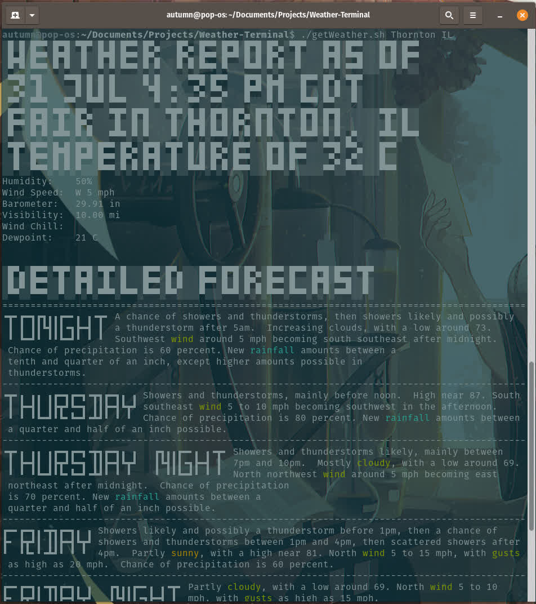

# National Weather Service Terminal Toy {#Title}
##### https://github.com/TechyTrickster/Weather-Terminal {#Link}

This is a small terminal toy / tool written entirely in bash with commonly available tools.  It reaches out to the USA National Weather Service website to run a search for location you hand it as an input.  It downloads the html of that web page and scrapes it for information and displays that data in a nicely formatted manner.  I wrote this program largely to improve my understanding of the bash scripting language, to act as practice for using git, and improve my skills with regular expressions. 



The program features automatic terminal size detection to facilitate flowing text next to the block spellings of the major time periods.  Additionally, the program makes use of colored highlighting of key words using standardized vt-100 compatible escape sequences.

The system extracts text using a series of heuristics based on html base tags and css class names along with some clever use of regex statements, all triggered through calls to grep and sed. [^1]


The block text is generated using toilet.  You indicate the area for which you'd like a forecast for by entering the town followed by the standard state name abreviation as arguments to the program at the command line.

| Syntax | Description |
| ----------- | ----------- |
| Header | Title |
| Paragraph | Text |

walkabout
: to go on an aimless journey of self exporlation

~~asdf~~
## task list
- [x] item one

==hightlighted text==

H~2~0

```
:::python
x = 1 if a == "2" else 0
```

[^1]: foot note test

>block quote of text of truth!!!
>more lines in quote


this is `text`!